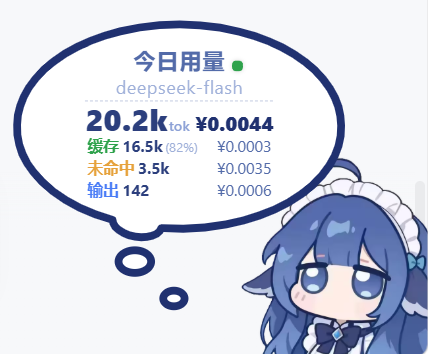
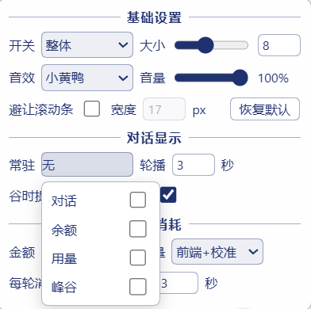
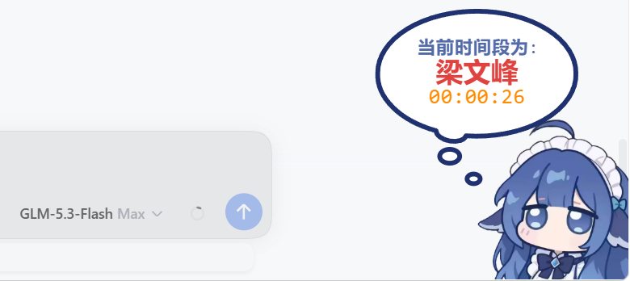
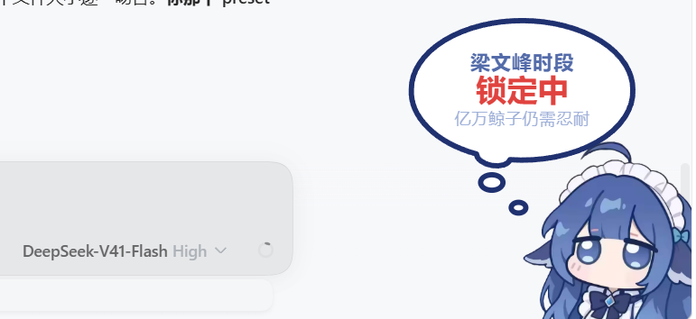
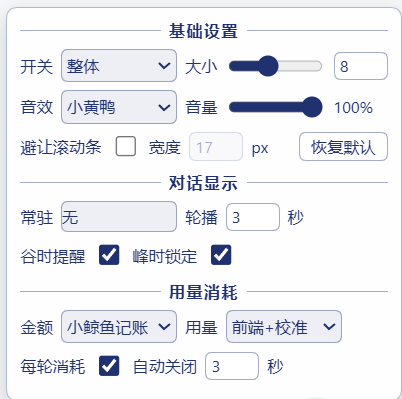
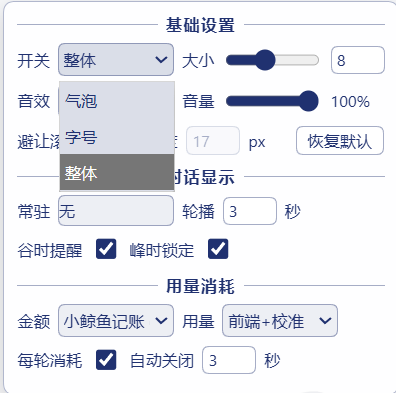
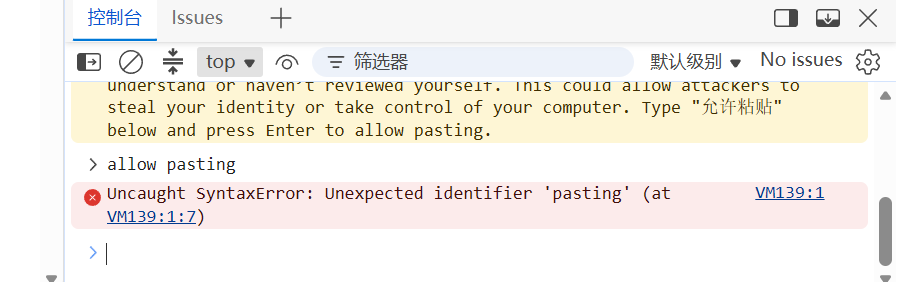

# dsh-whale-widget-w（W 魔改版说明）

> 本文件是 W 魔改版的说明，**只记录相对原版新增/修改的内容**。原插件的功能介绍、安装教程、用量模式说明等请阅读原版 [README.md](README.md)（本包内保留的即原作者的 README）。

## 魔改来源与致谢

- 原插件：**dsh-whale-widget**（DSH 小鲸鱼余额挂件），当前魔改基于其 **0.2.10** 版本
- 原作者仓库：**https://github.com/MeteorNOX/DeepSeek-Balance-Whale-Widget**
- 本项目遵循原项目的 **MIT License** 开源（见 [LICENSE](LICENSE)）
- **感谢原作者 MeteorNOX 及所有原项目贡献者**写出并持续维护这个可爱又实用的小鲸鱼挂件。本仓库只是站在巨人的肩膀上，按自己的需求做了调整与扩展，所有核心设计（挂件绘制、记账模式、峰谷定价、每轮消耗统计等）的功劳都属于原作者。
- 版本号规则：`<原版版本>-w.<魔改序号>`，例如 `0.2.10-w.2` 即基于原版 0.2.10 的第 2 代魔改。

## 版本沿革与代码对比

以 `lib/index.js` 行数为基准（git diff 统计，相似度 = 沿用行数 / 现版本总行数）：

| 演进 | 行数变化 | 沿用行数 | 代码相似度 | 定位 |
|---|---|---|---|---|
| 原版 0.2.10 → W.1 | +438 / −41 | 1982 行 | ≈ **82%** | 微调版：定价表 + 常驻/锁定等小幅扩展 |
| 原版 0.2.10 → W.2 | +1640 / −129 | 1894 行 | ≈ **54%** | 魔改版：数据链路、视图与交互大幅重构 |

> 后续版本（W.3 起）按「原版 0.2.10 → W.N」的格式依版本顺序向下追加，不做相邻版本间的对比。

文件级：两代魔改均保留原版全部文件结构（`lib/index.js` 单文件插件 + assets + README），未删改任何原版文档。

## W.1 改动清单（0.2.10-w.1，历史版本）

1. **更新 DeepSeek 定价表**（2026-09-10 调价）：deepseek-flash 空闲/高峰全档下调，`PRICING` 新增 `deepseek-flash` 模型 key
2. **常驻显示**（下拉单选）：无 / 峰谷时段 / 余额 / 对话气泡
3. **梁文峰时段锁定**：峰时（工作日 9-12 / 14-18）隐藏发送按钮 + 拦截 Enter，锁定气泡两视图轮播（锁定中 / 距梁文谷倒计时）
4. **菜单重排 + 全项悬停说明**（`MENU_TIPS` 表）
5. **插件标识**：改名 `dsh-whale-widget-w`、版本 `-w.1`、`package.json` 声明原作来源，可与原版共存

## W.2 改动清单（0.2.10-w.2，当前版本）

### 1. 数据链路：用量校准 + 平台令牌自动同步

- **校准模式**：官方用量数据为锚定基线 + 本地增量合并显示；官方数据未追上本地时不校准（防校丢）；官方不可用自动回退纯本地数据
- **平台令牌自动同步**：内置油猴脚本（`assets/dsh-whale-token-sync.user.js`），把 platform.deepseek.com 的登录令牌自动推送到本机端点，免手动 F12 抓令牌；重新登录平台后自动更新
- 适配 **Edge/Chrome 私网访问预检**（PNA）：正确应答 OPTIONS 预检与 `Access-Control-Allow-Private-Network` 头，解决"令牌同步静默失败"
- 官方接口适配：`end` 参数对齐本地零点、补 `x-client-platform` 头（否则返回 INVALID_PARAM）
- 令牌多层 JSON 包装自动解包；官方拉取失败自动重试（服务重启不再卡「暂无统计」）

### 2. 用量明细视图改版

- 今日 / 本月双视图，多模型按消耗排序轮播（点击切换）
- **总计 hero 行**（大号 token 数 + 加粗金额）+ 三行彩色标签明细（绿=缓存 / 黄=未命中 / 蓝=输出，命中率括号形式），金额右对齐
- 全零模型自动过滤（官方会下发账号全部模型，未调用的不展示）
- 指示灯跟随用量视图：**只要展示用量明细就显示**（灰=未配置令牌 / 黄=待校准 / 绿=已校准），组合勾选下同样生效




### 3. 常驻内容多选组合

- 「常驻」改为勾选面板：**对话 / 余额 / 用量 / 峰谷** 任意组合
- 全不选 = 无常驻；全选 = 随机（轮换全部）；部分勾选 = 点击气泡或轮播在勾选内容间切换（显示为 `X+X` / `X+X+X`）
- 用量子视图自动使用放大气泡，随机轮播按内容自适应大小框；GIF 组切换时正确清理上一组的文字残留



### 4. 峰谷视图增强（三行时段视图 / 谷时提醒 / 峰时锁定轮播）

- 常驻「峰谷」：当前时段名（空闲=绿 / 梁文峰=红）+ 下一时段倒计时，逐秒跳动
- **谷时提醒**：谷时最后 30 分钟自动切提醒视图（「梁文谷时段 即将结束」），峰时开始自动解除
- **峰时锁定**：峰时隐藏发送按钮 + 拦截 Enter 发送，气泡在「锁定中」与「距梁文谷倒计时」两视图间轮播（间隔 = 菜单「轮播」秒数）
  - 仅锁定 **DeepSeek 模型**：其他模型（如 GLM）完全不受影响，峰时照常调用
- 时段叫法点击气泡轮换：默认 / 梁文峰谷 / 峰峰

**峰时下两种模型的对比**（锁定只针对 DeepSeek）：

| 非 DeepSeek 模型（GLM）：不锁定，正常使用 | DeepSeek 模型：峰时锁定中 |
|---|---|
|  |  |

**谷时两种状态对比**：

| 空闲时段：谷时倒计时 | 最后 30 分钟：谷时提醒 |
|---|---|
|  |  |

### 5. 三路大小调节 + 恢复默认

- 「开关」改为目标选择：**气泡 / 字号 / 整体**，「大小」滑杆与数字框（**0–20 整数档**）独立调节所选部分
- **0 = 隐藏该部分**，调回大于 0 即恢复（8 ≈ 原始大小，20 最大）；整体 0 = 右下角整体隐身，悬停右下角唤出菜单拉回
- **恢复默认按钮**：一键全局重置（大小 8 档、小黄鸭音效 100%、常驻无、轮播 3 秒、自动关闭 3 秒等）
- 拖动整体大小时设置框保持固定不跟随





### 6. 其他

- 出厂默认对齐：音量 100%、轮播 3 秒、自动关闭 3 秒、初始大小 1.0×
- 旧配置自动迁移（总开关三态 → 对应部分 0 档；单选常驻 → 对应勾选；前端来源 → 合并来源）
- 内置**峰谷假时间线测试脚本**（`FAKE_TRANSITION_TEST`，默认关闭）：谷 30 秒 → 峰 30 秒 → 还原，免等待真实时段切换即可测试峰谷全流程；正式使用保持 false，不影响任何功能
- 安全性：API Key 经 DSH 凭据服务读取、不落盘不回显；平台令牌仅存本机 `~/.dsh/`、仅发往本机 127.0.0.1；HTTP 服务仅监听 127.0.0.1；无遥测、无第三方请求

## 安装（W 魔改版）

已上传 GitHub 后，参考地址方式安装（二选一）：

```powershell
# 独立仓库
dsh plugin --profile web add github:WIMIN144/dsh-whale-widget-w
# 或 monorepo 分支式
dsh plugin --profile web add github:WIMIN144/DSH#<分支名>
```

> `github:` 方式直接从 GitHub 拉取仓库安装，**不需要 npm 账号、也不需要发布到 npm**；npm 发布是另一条完全可选的路，本仓库未使用。

本地开发安装：

```powershell
dsh plugin --profile web add link:<本目录绝对路径>
```

> ⚠️ 本版与原版 `dsh-whale-widget` 可共存，但气泡是同一个屏幕位（右下角），**建议二选一启用**。卸载：`dsh plugin --profile web remove dsh-whale-widget-w`

## 平台令牌自动同步配置（可选）

> 不配置也能正常用：金额走小鲸鱼记账、用量显示前端聚合数据（指示灯灰色）。配置后官方数据自动校准对齐（黄 → 绿）。

### 手动配置三步

1. 浏览器（Edge/Chrome）安装 **Tampermonkey** 扩展
2. dsh web 运行中，浏览器打开 `http://127.0.0.1:3080/dsh-whale/token-sync.user.js` → Tampermonkey 自动弹出安装页 → 点**安装**（脚本 v1.0.1+）


3. 打开并登录 [platform.deepseek.com](https://platform.deepseek.com)，**刷新一次页面**。浏览器若弹出「platform.deepseek.com 想要访问此设备上的其他应用和服务」权限框 → 点**允许**

验证：F12 打开控制台（Console），出现 `[dsh-whale] 平台令牌已同步到本地 DSH 挂件` 即成功；挂件指示灯随后变黄/绿。

> 说明：令牌只从 DeepSeek 官网页面发往你本机 `127.0.0.1:3080`，不经过任何第三方；令牌保存在本机 `~/.dsh/.dshw-platform-token.json`；重新登录平台后脚本会自动推送新令牌。

### AI 辅助部署提示词（不想手动操作？把下面整段复制给 AI 助手）

````text
请帮我完成 DSH 小鲸鱼挂件的「平台令牌自动同步」部署与验证。背景：
- 本机已运行 dsh web，监听 127.0.0.1:3080（网页需带 token 打开，但 /dsh-whale/* 插件路由无需鉴权）。
- 插件提供两个本地端点：
  1. GET  http://127.0.0.1:3080/dsh-whale/token-sync.user.js —— 油猴脚本源码（UserScript，@match https://platform.deepseek.com/*，当前版本 ≥1.0.1）
  2. POST http://127.0.0.1:3080/dsh-whale/platform-token —— 请求体 {"token":"..."}（Content-Type: text/plain 即可），令牌长度须 ≥40
- 脚本逻辑：读取 platform.deepseek.com 页面 localStorage 的 userToken（值可能是 {"value":"..."} 等包装结构，需逐层解包到以 ey 开头或长度≥40 的令牌本体），POST 到上述端点。
- 服务端已正确应答 Chromium「私有网络访问」预检（OPTIONS 返回 204 并带 Access-Control-Allow-Private-Network: true），因此浏览器会弹出一次「platform.deepseek.com 想要访问此设备上的其他应用和服务」权限框——必须选择允许，否则同步会静默失败。

请按以下步骤执行：
1. 用 curl 访问 http://127.0.0.1:3080/dsh-whale/token-stats.json，确认返回 JSON 且服务在线。
2. 检查浏览器是否已安装 Tampermonkey：若无，引导用户安装；若已有，打开
   http://127.0.0.1:3080/dsh-whale/token-sync.user.js 并确认 Tampermonkey 安装页显示的脚本版本 ≥1.0.1，点击安装/重新安装。
3. 打开 https://platform.deepseek.com 并确认用户已登录（能看到用量信息页面）。
4. 触发同步：刷新 platform.deepseek.com 页面（脚本在页面加载时自动推送令牌）。
5. 验证：再次 GET http://127.0.0.1:3080/dsh-whale/token-stats.json，确认 JSON 中 "tokenSet":true 且 officialError 为空；此时挂件的校准指示灯应为黄色或绿色。
6. 若第 5 步 tokenSet 仍为 false：在 platform.deepseek.com 页面按 F12 打开控制台（Console），粘贴执行一段代码——读取 localStorage.getItem('userToken')、逐层解包 JSON 包装（{value:...}/{token:...}）、去除 Bearer 前缀后，POST 为 {"token":"<令牌>"} 到
   http://127.0.0.1:3080/dsh-whale/platform-token（Content-Type: text/plain）；然后重做第 5 步。若仍失败，把控制台以 [dsh-whale] 开头的日志原样报告。
7. 安全要求：令牌只允许在本机与 127.0.0.1 端点之间流转；任何步骤都不得把令牌完整内容打印到日志、聊天或截图中。
````

## 打包前检查（维护者备忘）

- `lib/index.js` 中 `FAKE_TRANSITION_TEST = false`（峰谷假时间线测试脚本，代码保留、默认关闭）
- `package.json` 的 repository/bugs/homepage 已填真实仓库地址
- 本 README-W 的改动清单与版本号已更新
